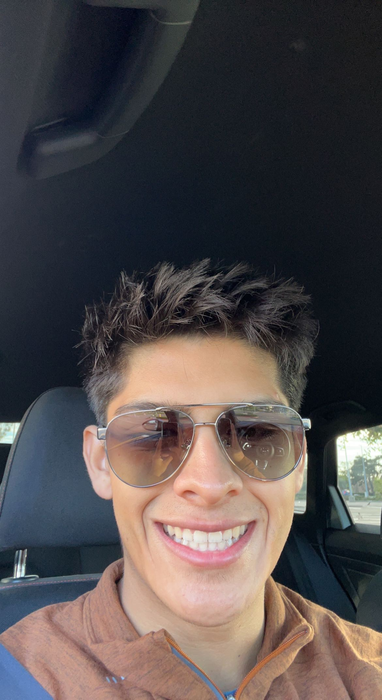

# Emmanuel Serrano



## Table of Context
 - [Meet me](#meet-me)
 - [Meet the Programmer](#meet-the-programer)
 - [Checklist for Quarter](#check-list-for-quarter)
 - [Conclusion](#conclusion)

##  Meet me 

*BALL, CODE, SLEEP, and REPEAT*


> That right there, basically sums up my life at the moment. A computer science major at UCSD, going into his third year, who loves going to the gym to lift but mostly to go play basketball, and does in fact like to have his 8-10 hours of sleep. 


## Meet the Programer

> Although I feel no where close to be a "REAL" programmer yet. I still good to note that I think I been getting better and better ever since I wrote my first line of code.

``` Python
print("HelloWorld!")
```

> Which happened in first college class, CSE8A. So in time I hope to one day think of myself as a REAL programmer but till then still excited to learn and thought I tell you a bit more about what I learned and done so far.

#### Coding languages I know
- C++
- C
- Python
- Java
- ARM

#### Favorite Games I Programed

1. 2048
2. Rock, Paper, Scissors
3. Snake

## Check List for Quarter
- [x] Ready to learn:exclamation:
- [x] Finish my first Markdown Page :tada:
- [x] Have a cool CSE 110 Professor :star:
- [ ] Pass my CSE 110 class ... (Check back at the end of the quater :wink:)

##  Conclusion 
In conclusion, this was a little introduction to me and if you want to go to the README for the class Project it be below along with a shoutout to Github Pages it below as well for the help. So overall excited to have a successfully quarter, and see you in class.

This is the [README](README.md) for my Github CSE110 Project

ShoutOut to [GitHub Pages](https://pages.github.com/) for helping to build this site and completely LAB0.

[Back to top](#emmanuel-serrano)


